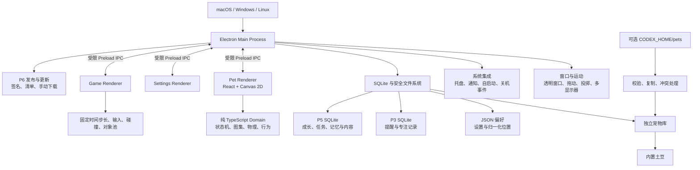

# Desktop Pet V2 架构

创建者：husu

## 架构目标

Desktop Pet V2 必须在未安装 Codex 时独立运行。Codex 只作为可选宠物包来源，不得
成为启动依赖、更新依赖或提醒依赖。

## 进程职责

### Electron 主进程

- 创建和管理透明宠物窗口、设置窗口和游戏窗口
- 读取系统光标位置，移动原生窗口
- 管理系统托盘、通知、自启动、关机事件和更新
- 独占 SQLite 和用户数据文件访问
- 对 IPC 输入做类型、范围和发送者校验

### Preload

- 只暴露声明过的桌宠 API
- 不向 Renderer 暴露 Node.js、Electron 对象或任意文件系统能力
- 保持 `contextIsolation: true`、`nodeIntegration: false`、`sandbox: true`

### Renderer

- Canvas 直接裁切 Codex 图集；存在有效动作旁车时，优先裁切项目专属动作图集
- React 只管理设置界面和轻量 UI 状态
- 不负责原生窗口坐标、持久化或系统权限

### 纯 TypeScript Core

- 不依赖 Electron、React 或 DOM
- 状态机、物理、提醒调度和游戏规则可直接单元测试
- 使用 Python 版本的行为测试作为迁移基线

### P1 偏好存储

- 主进程在 `userData/preferences.json` 保存设置与显示器归一化位置。
- 位置使用 `displayId + xRatio + yRatio`，不保存不可移植的绝对屏幕坐标。
- 文件使用临时文件加原子替换写入；P2 引入 SQLite 后，偏好仍可保持轻量 JSON，
  宠物库、提醒和成长数据再进入数据库。

### P2 宠物库

- `PetPackageValidator` 在主进程中校验 manifest、图集尺寸、透明区、文件边界和哈希。
- 可选 `desktop-pet-actions.json + actions.webp` 不修改 Codex manifest；校验失败时整包拒绝。
- `PetLibrary` 只把校验后的副本写入 `userData/pets`，并保留来源标记。
- `PetCatalog` 合并内置宠物、本地宠物和未导入的 Codex 外部条目。
- Renderer 只通过 `pet-asset://current/spritesheet` 和受限的
  `pet-asset://current/actions` 访问当前基础图集与可选动作图集。
- 详细边界见 `docs/p2-pet-library-and-system-integration.md`。

### P3 提醒与专注

- `ReminderEngine` 和 `FocusTimer` 是不依赖 Electron、React 或 DOM 的纯 TypeScript。
- `AssistantDatabase` 是主进程唯一的数据访问入口，使用 better-sqlite3。
- 系统通知、宠物动作和退出清单由主进程编排。
- macOS/Linux shutdown 和 Windows session-end 都只提供尽力延迟语义。
- 详细规则见 `docs/p3-reminders-and-focus.md`。

### P4 小游戏

- 游戏规则在纯 TypeScript 中实现，Renderer 只负责输入、固定步长驱动和 Canvas。
- 主进程只接受当前游戏窗口提交的受限结果，并做数值范围校验。
- 聚合记录、单局结果和每日奖励由 `AssistantDatabase` 事务写入。
- 当前宠物通过受限 `pet-asset://` 协议进入游戏 Canvas。
- 详细规则见 `docs/p4-games.md`。

### P5 成长与内容

- `PetGrowthEngine`、每日任务和随机事件保持纯 TypeScript，可独立测试。
- SQLite 事务统一结算游戏、喂食、任务、成就、背包与长期记忆。
- 内容包只允许受限纯数据资源，ZIP 在复制前后各校验一次。
- 对话默认离线，在线请求仅由主进程发起；密钥进入系统 Keyring，不进入
  Renderer、偏好、SQLite、JSON 导出或日志。
- 完整对话只保存在当前运行内存，长期记忆必须明确确认并通过敏感信息策略。
- 数据库恢复前执行完整性与必要表检查，并保留自动回滚副本。
- 详细规则见 `docs/p5-growth-content.md`。

### P6 发布与更新

- GitHub Actions 在五个原生平台/架构 runner 上构建，避免交叉编译原生模块冒充真机。
- 手动预览与稳定标签分离；稳定标签缺少 Developer ID、公证或 SignPath 配置时失败。
- 发布工具重新计算每个安装文件的大小和 SHA-256，再聚合 SPDX SBOM 和更新清单。
- `UpdateService` 是纯 TypeScript 校验层；Renderer 不直接联网或打开任意 URL。
- 更新仅提供手动检查和系统浏览器下载入口，安装仍由各平台签名安装器处理。
- 详细规则见 `docs/p6-release-distribution.md` 和 `docs/release-operations.md`。

## P0 决策

1. 不使用 Next.js standalone server。桌宠没有本地 API 服务需求，Vite 静态页面能
   减少端口、资源复制和 packaged server 故障面。
2. 拖动阶段由主进程以约 60Hz 读取系统光标，避免窗口移动导致 Renderer 丢失连续
   鼠标坐标。
3. 投掷物理运行在主进程，Canvas 只根据 motion state 切换动画。
4. 不给 Canvas 增加 `drop-shadow`、锐化或边框；窗口同时关闭原生阴影。
5. `100%` 大小严格对应一格 `192×208`，高 DPI 通过 Canvas backing store 处理。
