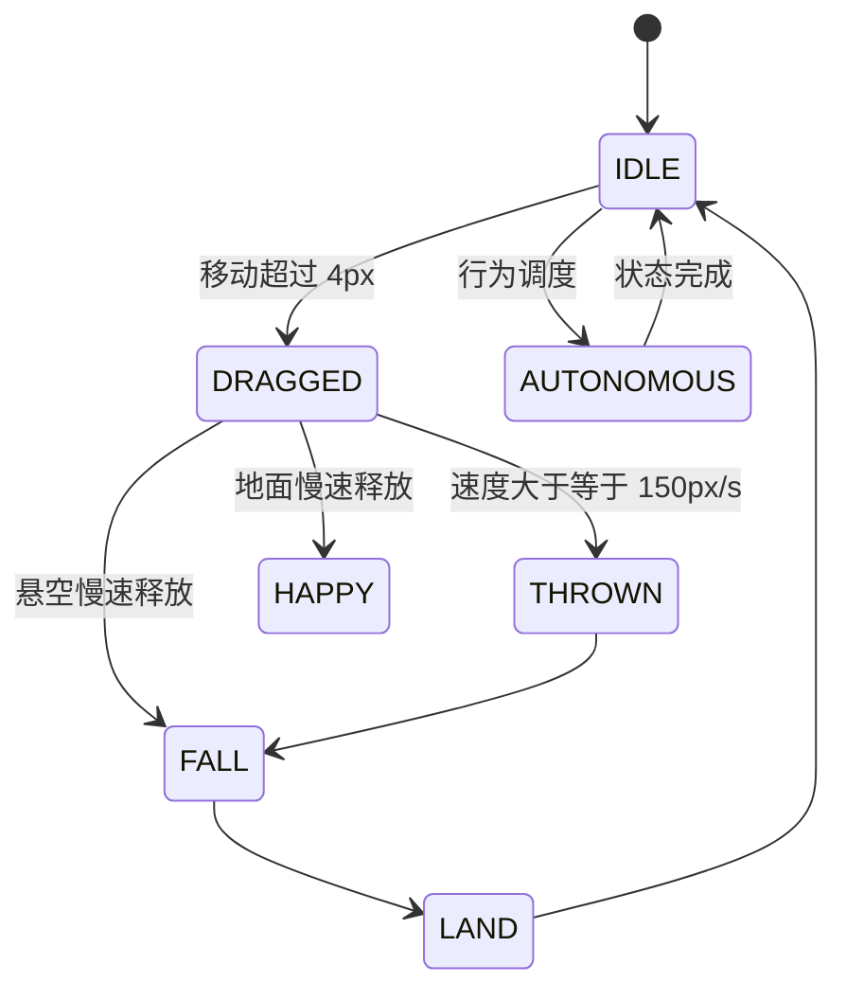

# P1 行为、动作与多屏位置

创建者：husu

## 迁移基线

P1 逐项对照 `desktop_pet/pet/state_machine.py`、
`behavior_selector.py`、`codex_sprite_repository.py` 和
`pet_controller.py` 实现，没有从界面表现反推状态参数。

## 状态优先级

拖动与物理计时器运行时，自主状态更新暂停。释放速度使用最近八个采样区间的加权
平均；投掷速度按原项目乘以 `0.9`，并限制在水平 `±1450`、垂直 `±1300`。

## Codex v2 动作

| 动作 | 图集行 | 用途 |
| --- | ---: | --- |
| idle | 0 | 待机、眨眼、睡眠过渡 |
| running_right / running_left | 1 / 2 | 拖动、散步、奔跑、追逐 |
| wave | 3 | 开心、互动、玩耍 |
| jump | 4 | 跳跃、投掷、下落、落地 |
| failed | 5 | 生气、难过、害怕、眩晕 |
| wait / run / review | 6 / 7 / 8 | 等待、扩展奔跑、好奇与事件 |
| look | 9 / 10 | 16 个方向；中心帧复用待机第 7 帧 |

## 多屏恢复

保存位置时，先确定宠物中心所在显示器，再用窗口左上角相对工作区可移动范围计算
`xRatio` 和 `yRatio`。恢复时优先匹配原 `displayId`；显示器不存在则回退主显示器。
最终坐标始终限制在工作区内，避免宠物被菜单栏、Dock 或已移除显示器吞掉。

## 验证

- 7 个 Vitest 文件、24 个用例通过。
- ESLint、TypeScript 和生产构建通过。
- macOS arm64 未签名目录包构建通过。
- 实际设置面板观察到 `CURIOUS`、`WALK_LEFT`、`LOOK_AT_CURSOR`。
- 活跃度和自主移动设置通过退出、重启持久化验证。
- 双击与拖动冲突在实际验收中发现并修复。
