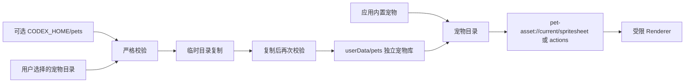

# P2 宠物库与系统集成

创建者：husu

## 完成范围

P2 将 Desktop Pet V2 从单一内置资源扩展为独立宠物库，并接入托盘和开机自启动。
应用不从 Codex 目录直接运行宠物；Codex 仅是可选的导入和导出来源。

## 宠物包规则

- 支持 Codex v1 和 v2 `pet.json`。
- 宠物 ID 只允许 ASCII 字母、数字、下划线和短横线，长度不超过 64。
- `pet.json` 最大 128 KiB，图集最大 64 MiB。
- 图集只允许包内单个 `.png` 或 `.webp` 文件，不允许路径穿越或符号链接。
- 图集像素尺寸必须与声明的单元格、行列数完全一致。
- 必需动作单元格必须含有非透明像素，未使用单元格必须保持透明。
- 可选动作旁车固定使用 `desktop-pet-actions.json`，其图集保持 `192×208` 单元格、
  显式逐帧时长和状态映射；缺失映射回退 Codex 基础动作。
- 无旁车时，内容身份使用 `SHA-256(pet.json 原始字节 + 图集原始字节)`；有旁车时
  继续追加动作清单与动作图集原始字节。
- 导入先写临时目录，复制后再次校验，再以原子重命名进入正式目录。

同 ID 同内容会跳过；同 ID 不同内容会报告冲突，不会静默覆盖。Renderer 只能通过
受限的 `pet-asset://current/spritesheet` 和 `pet-asset://current/actions` 协议读取
当前宠物图集，不能获得任意文件系统访问能力。

## Codex 同步验证

在 macOS arm64 打包应用中完成了真实同步：

1. 首次从 `~/.codex/pets` 同步土豆，报告新增 1。
2. 再次同步，报告未变化 1。
3. 将当前宠物导出到 Codex，报告未变化 1。
4. 应用本地副本与 Codex 原文件的 manifest 和图集 SHA-256 一致。

本地宠物副本保存在 Electron `userData/pets`。即使 Codex 未安装、目录被移动或
Codex 退出，已经导入的宠物仍可独立使用。

## 系统集成

- macOS、Windows 使用 Electron 登录项接口管理自启动。
- Linux 使用用户级 XDG autostart `.desktop` 文件。
- 开发模式不会写入系统自启动项。
- 托盘提供当前状态、宠物切换、设置、位置重置、Codex 同步、自启动和退出入口。
- 应用图标使用项目维护者拥有的土豆资源，分别提供 macOS、Windows 和 Linux 格式。

## 验证结果

- 9 个测试文件、32 个测试用例通过。
- lint、TypeScript 类型检查和生产构建通过。
- macOS arm64 目录包可启动。
- 打包后的 Sharp 原生依赖已进入 `app.asar.unpacked`。
- 动态 `pet-asset://` 图集在打包环境中正常渲染。
- 设置面板中的宠物目录、同步、导出和自启动控件可访问。
