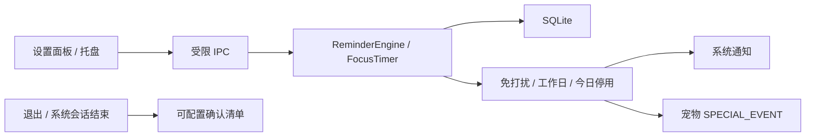

# P3 提醒、专注与退出检查

创建者：husu

## 能力范围

P3 迁移原项目的健康提醒和专注计时，并补齐 Desktop Pet 最初需求中的吃饭、保存
文件、下班收拾和退出前检查。

## 内置提醒

| ID | 默认计划 | 默认状态 |
| --- | --- | --- |
| `water` | 每 45 分钟喝水 | 开启 |
| `sedentary` | 每 60 分钟起身活动 | 开启 |
| `rest` | 每 30 分钟远眺休息 | 开启 |
| `meal` | 每日 12:00、18:30 吃饭 | 开启 |
| `save-work` | 每 30 分钟保存工作文件 | 开启 |
| `tidy-up` | 工作日 18:00 收拾物品 | 开启 |

前三项的默认周期与原 Python 项目保持一致。内置提醒可以改标题、计划、启用状态和
工作日规则，但不能删除；用户创建的自定义提醒可以删除。

## 调度语义

- 间隔提醒按真实经过时间计算，范围 1 分钟到 7 天。
- 每日提醒支持最多 12 个本地时刻，自动排序和去重。
- 总工作日规则和单提醒工作日规则可以叠加。
- 免打扰支持普通时段和跨午夜时段；开始与结束相同表示不启用免打扰。
- 到期提醒在免打扰期间保持待处理，离开免打扰时段后再发送。
- “稍后提醒”默认 10 分钟，可配置为 1 到 240 分钟。
- “今日停用”使用本地日期，下一天自动恢复。
- 提醒送达后更新下次时间，避免重复发送。

## 专注计时

- 支持 15、25、45、60 分钟快捷时长和 1 到 180 分钟自定义时长。
- 使用单调时钟计算真实经过时间，系统时间调整不会改变进行中的倒计时。
- 暂停时间不计入已用时。
- 支持开始、暂停、继续、停止和完成记录。
- 应用非正常退出后，残留的 `running` 记录在下次启动时标记为 `interrupted`。
- 完成时发送系统通知并触发宠物开心动作。

## SQLite

数据文件位于 Electron `userData/assistant.db`，使用 WAL、外键、5 秒 busy timeout 和
约束表结构。当前包含：

- `app_metadata`：提醒全局设置和退出清单；
- `reminders`：提醒计划、下次时间、稍后时间和今日停用日期；
- `focus_sessions`：专注计划、实际时长和完成状态。

数据库只由 Electron 主进程访问，Renderer 不接触文件系统和 SQL。

## 系统通知与宠物联动

- 到期提醒使用 Electron 原生通知。
- 点击通知会打开设置面板。
- 提醒发送时宠物切换到 `SPECIAL_EVENT`。
- 专注完成时宠物切换到 `HAPPY`。
- 设置面板提供测试提醒，用于验证系统权限和动作联动。

## 退出与关机边界

默认检查项：

1. 工作文件是否已经保存；
2. 随身物品是否已经收拾。

普通退出会先显示确认清单。macOS/Linux 监听系统 shutdown，Windows 监听
`query-session-end`。这些接口只能尝试延迟退出或会话结束，操作系统仍可能在超时后
强制终止应用，因此产品不承诺无限期阻止关机。

## 验证结果

- 12 个测试文件、41 个测试用例通过。
- lint、TypeScript 类型检查、生产构建和 macOS arm64 目录包通过。
- 打包后的 `better-sqlite3` 已按 Electron 43 arm64 重建并成功加载。
- 真实完成专注开始、暂停、继续、停止。
- 暂停后等待，倒计时保持不变。
- 真实发送系统测试通知并观察到 `SPECIAL_EVENT`。
- 真实新增并删除自定义提醒，验收数据已清理。
- 真实弹出退出检查清单，取消后应用继续运行。
- SQLite `PRAGMA integrity_check` 返回 `ok`。
