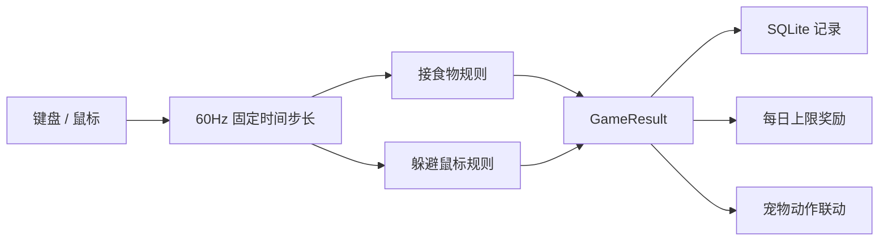

# P4 小游戏、记录与奖励

创建者：husu

## 完成范围

P4 迁移原 Python 项目的固定时间步长、连击计分、接食物和躲避鼠标两类核心玩法，
并将游戏记录与每日奖励接入 P3 的 SQLite。

## 共用规则

- 固定步长为 `1/60s`。
- 单帧时间最大按 `0.1s` 处理。
- 单帧最多补 5 次更新，超过后丢弃余量，避免窗口卡顿后物理爆炸。
- 连击超时、5/10/20/30 里程碑和 `1.2/1.5/2/3` 倍率与原项目一致。
- 失去窗口焦点自动暂停，`Esc` 暂停或继续。
- 结果分为完成、取消和窗口关闭；只有完成结果发放奖励。

## 接食物大作战

- 标准局 60 秒，开始前 3 秒倒计时。
- 鼠标、A/D 和左右方向键都可移动土豆。
- 迁移 14 类配置物：普通食物、高级食物、稀有食物、加时、磁铁、护盾、双倍、
  炸弹、辣椒和空盘子。
- 支持连击、狂热、磁铁、护盾、双倍分数、反向控制和最多 15 秒加时。
- 漏掉食物会增加漏接数并中断连击；炸弹扣分，护盾可抵消。
- S/A/B/C 分数线为 2400/1500/850/350。

## 躲避鼠标挑战

- 标准局 45 秒，开始前 3 秒倒计时。
- 土豆根据鼠标距离逃跑，包含警戒圈、危险圈、加速度、摩擦和边界反弹。
- 危险距离内可消耗体力冲刺；体力持续恢复。
- 玩家点击土豆得分，冲刺和挑衅状态可获得额外分数。
- 命中后短暂僵直，点空中断连击。
- S/A/B/C 分数线为 3500/2400/1500/700。

## 记录与奖励

SQLite 新增：

- `game_records`：最高分、次数、最高连击、最佳评级和最佳命中率；
- `game_results`：每局结果、结束原因和实际奖励；
- `game_daily_rewards`：经验、好感和属性奖励的每日计数。

奖励规则沿用原项目：

- 每日前 3 局完成游戏可获得经验；
- 每日前 5 局完成游戏可获得好感；
- 每日属性增益上限为 30；
- 接食物奖励饱腹和心情；
- 躲避鼠标消耗体力并奖励心情；
- 取消游戏会保存成绩记录，但不发放奖励。

## 验证结果

- 13 个测试文件、46 个测试用例通过。
- lint、TypeScript 类型检查、生产构建和 macOS arm64 目录包通过。
- 两个真实游戏窗口均成功启动并显示当前土豆图集。
- 接食物实际产生物品、接住食物、计分、暂停和取消记录。
- 躲避鼠标实际命中土豆并获得分数。
- 完整运行 45 秒回合，显示评级、历史最高分和奖励面板。
- 设置面板实时显示两类游戏的最高分和次数。
- SQLite `PRAGMA integrity_check` 返回 `ok`。

## 后续边界

原项目中的篮球喂食、影分身、舞台唱歌、Boss 检查等剧情型随机事件尚未进入 P4。
这些事件依赖 P5 的成长、背包、任务和内容包，将在 P5 内容系统建立后继续迁移。
