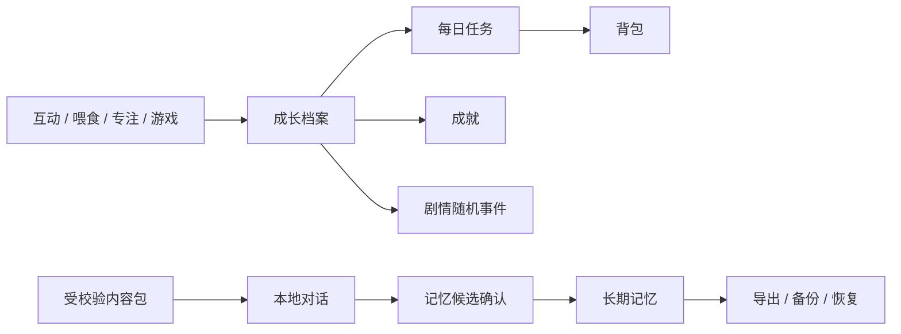

# P5 成长、内容与隐私系统

创建者：husu

## 目标

在不改变 P0–P4 桌宠、提醒和游戏规则的前提下，将旧版 `desktop_pet` 的成长、
任务、成就、背包、对话、长期记忆、内容包、随机事件和备份能力迁移到独立的
TypeScript/Electron 架构。所有持久数据继续由主进程独占，Renderer 只经受限 IPC
访问。

## 规格场景

### 成长与照料

- 首次启动创建 1 级土豆和旧版一致的六维初始属性。
- 经验需求使用 `100 × level^1.35`，一次奖励可以连续升级。
- 等级 2–5 解锁旧版动作与称号，关系值限制在 `0–1000`。
- 小游戏奖励必须与游戏结果在同一 SQLite 事务中写入成长档案。
- 属性按真实时间缓慢变化，普通推进最多补 6 小时，离线补偿最多 12 小时。
- 喂食需要存在对应库存，吃饱、冷却中或库存不足时不得修改数据。
- 睡眠持续恢复体力，唤醒后恢复普通状态。

### 任务、成就与背包

- 每天基于日期稳定生成 3 个普通任务和 1 个挑战任务。
- 互动、喂食、小游戏、分数、专注和长期记忆按真实事件推进。
- 已完成任务奖励只允许领取一次，并进入同一成长事务。
- 首次互动、首次专注、首条记忆和单局 500 分等成就只解锁一次。
- 背包拒绝未知类型、非正数发放和超量消耗。

### 内容包

- 只允许 JSON、图片、音频和文本资源，禁止脚本、可执行文件、符号链接和路径穿越。
- 限制文件数、单文件体积和解压后总体积，并校验 UTF-8 JSON。
- 同 ID 内容包不静默覆盖；启用、停用和卸载状态落库。
- 启用包中的离线台词最多聚合 200 条，每条最多 120 字。

### 对话与长期记忆

- 默认本地对话，完整聊天只保留在当前进程内。
- 白名单命令只返回意图，由主进程执行，不允许模型声称执行未确认操作。
- 在线提供方为可选能力；失败时回退本地，密钥不进入 Renderer、偏好或 SQLite。
- 只有用户明确说“记住”或“我叫/叫我”才产生记忆候选。
- 候选必须二次确认；密码、验证码、密钥、Token、证件号、银行卡和精确住址拒绝保存。

### 随机事件与数据安全

- 随机事件受等级约束并抑制最近三次重复。
- 事件只映射到已有宠物动作；宝箱奖励通过成长/背包服务结算。
- JSON 导出不包含在线密钥或完整会话历史。
- 数据库备份使用 SQLite 一致性备份；恢复前校验备份并保留可回滚副本。

## 执行任务

- [x] 5.1 宠物档案、属性推进、喂食、睡眠和游戏奖励闭环
- [x] 5.2 每日任务、成就、背包与事件进度
- [x] 5.3 内容包严格校验、安装、启停、卸载和台词聚合
- [x] 5.4 本地对话、可选在线提供方和安全密钥
- [x] 5.5 明确确认的长期记忆与敏感信息拒绝
- [x] 5.6 剧情随机事件与成长/背包奖励
- [x] 5.7 数据导入、导出、SQLite 备份与恢复
- [x] 5.8 Electron IPC、设置面板、宠物动作联动和真实桌面验收

## 合规矩阵

| 规格场景 | 状态 | 证据 |
| --- | --- | --- |
| 首次档案、连续升级、属性范围 | 通过 | `pet-growth.test.ts` |
| 游戏奖励同事务进入成长档案 | 通过 | `assistant-database.test.ts` |
| 喂食库存、冷却、饱食拒绝 | 通过 | 单元测试与 packaged 实际喂食 |
| 睡眠和离线时间补偿 | 通过 | 单元测试与 packaged 睡眠/唤醒 |
| 每日 3+1 任务、一次性领取 | 通过 | `daily-task-system.test.ts` 与数据库测试 |
| 成就、连续陪伴、背包约束 | 通过 | `assistant-database.test.ts` |
| 内容包安全校验和生命周期 | 通过 | `content-pack.test.ts` |
| 本地对话与在线失败降级 | 通过 | `conversation-memory.test.ts` 与 packaged 本地对话 |
| 系统 Keyring 密钥存储 | 通过 | `credential-store.test.ts` 与 packaged 可用性检查 |
| 明确确认记忆和敏感拒绝 | 通过 | 单元测试与 packaged 确认/拒绝交互 |
| 10 个随机事件和宝箱奖励 | 通过 | `story-event-system.test.ts` 与 packaged 事件动作 |
| JSON 迁移和 SQLite 备份恢复 | 通过 | `data-portability.test.ts` |

## 验证结果

- 20 个测试文件、77 个测试用例通过。
- lint、TypeScript 类型检查、生产构建和 macOS arm64 目录包通过。
- npm 官方生产依赖审计为 0 个漏洞。
- packaged 应用已实际验证喂食、任务进度、睡眠/唤醒、本地对话、记忆拒绝、
  系统 Keyring 可用性和剧情事件。
- 实际用户数据库 `PRAGMA integrity_check` 返回 `ok`。
